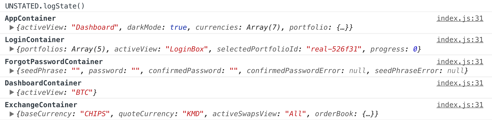
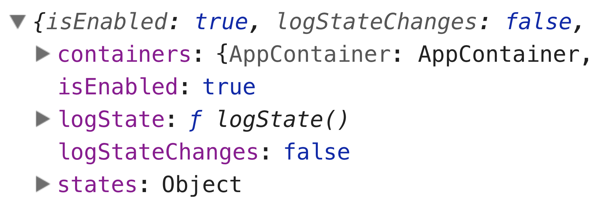
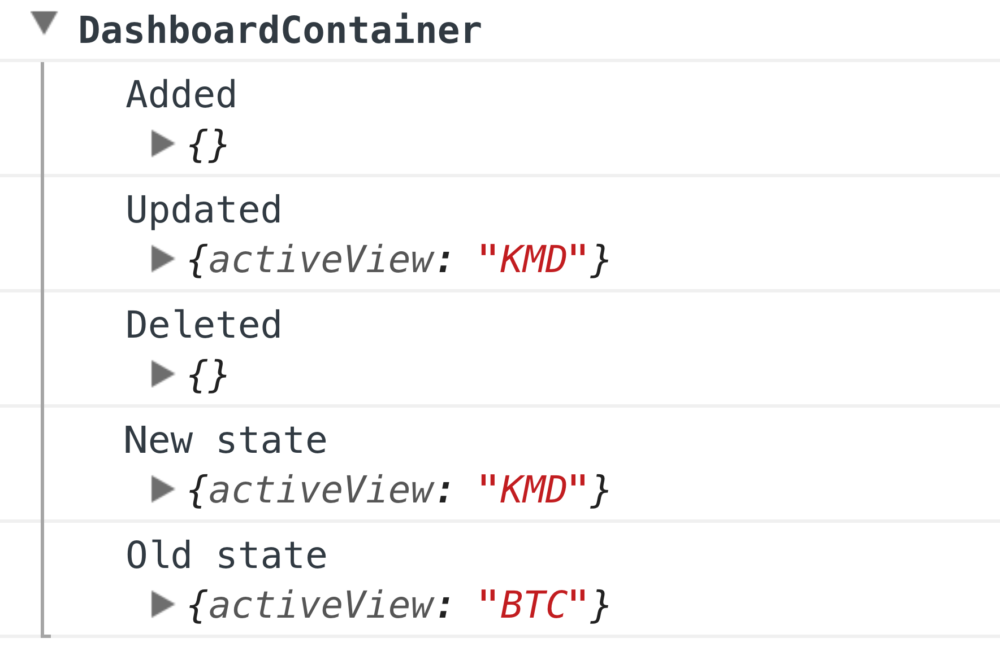

# unstated-debug

> Debug your [Unstated](https://github.com/jamiebuilds/unstated) containers with ease

<br>



## Install

```
$ npm install unstated-debug
```


## Setup

In the root of your app, import `unstated-debug`:

```js
import React from 'react';
import {render} from 'react-dom';
import {Provider} from 'unstated';
import UNSTATED from 'unstated-debug';
import App from './components/App';

UNSTATED.logStateChanges = false;

render(
	<Provider>
		<App/>
	</Provider>,
	document.querySelector('#root')
);
```


## Usage

When enabled, it exposes a global object `UNSTATED` which you can use in DevTools to explore the containers and their state.



The object contains the following properties:

- `isEnabled` - Same as the below option, but you can change it after init.
- `logStateChanges` - Same as the below option, but you can change it after init.
- `isCollapsed` - Collapse logs. (Default: false)
- `containers` - Your containers.
- `states` - The state objects of your containers.
- `logState()` - Logs the current state of your containers.


## API

### UNSTATED

##### isEnabled

Type: `boolean`<br>
Default: `true`

Toggle debugging.

For example, if you use this in an Electron app, you could pass it [`is.development`](https://github.com/sindresorhus/electron-util#is) to ensure debugging is disabled in production.

##### logStateChanges

Type: `boolean`<br>
Default: `true`

Logs a diff for each state change to the containers. This gives you a live insight into state changes in your app.


